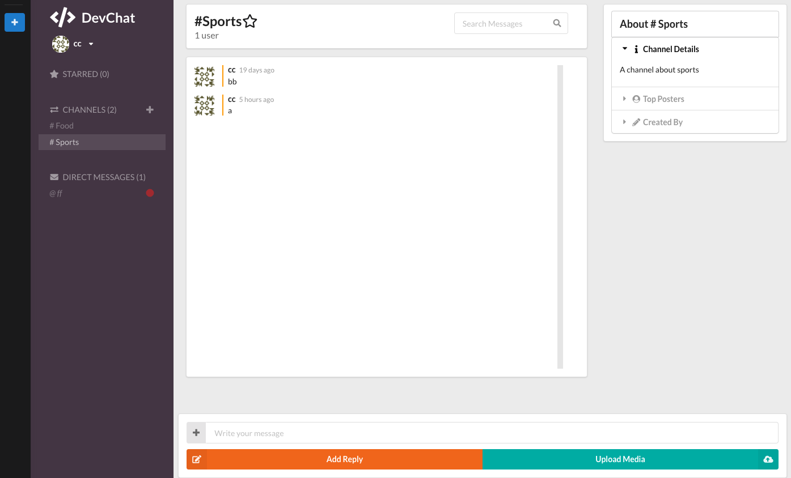

# React-slack-app

## react-router おさらい

- react-router を使って呼び出したいコンポーネントを index.js の Root で書く

```
 const Root = () => (
  <Router>
    <Switch>
      <Route exact path="/" component={App} />
      <Route path="/login" component={Login} />
      <Route path="/register" component={Register} />
    </Switch>
  </Router>
)
```

## firebase のセットアップ

- firebase をググってログインして[プロジェクトを追加]の鉄板の流れ
- リダイレクトで管理画面に飛ぶので[開始するアプリ]で web を選択
- script をコピーして src/firebase.js を使ってペタッとはる
- gitignore に一応 firebase.js を追加しておく

```
import firebase from 'firebase/app';
import 'firebase/auth'
import 'firebase/database'
import 'firebase/storage'


var config = {
 //ここペタッと貼るところ
};
firebase.initializeApp(config);

export default firebase;
```

- Authentication でプロバイダ（メールとか fb とか tw）でログインできる選択をする（※これしないと 400 エラー）

## scroll 系

- Element.scrollIntoView()
- https://developer.mozilla.org/ja/docs/Web/API/Element/scrollIntoView
- これ便利

## firebase

- ストレージ、DB 周りのルールは運用時変更する

### firebase デプロイ

- npm i firebase-tools -g
- firebase login で y を押してログインする
- firebase init
- もろもろぽちぽちしていく
- npm run build で public とデプロイ用のファイルを作る
- firebase deploy

## 完成図


